# Class Diagram

## Overview
이 문서는 프로젝트의 클래스 구조를 백엔드와 프론트엔드로 나누어 시각화합니다.

---

## 1. Backend Class Diagram

### 1.1 Overall Backend Architecture

### 1.2 Backend Module Structure

```mermaid
classDiagram
    %% Auth Module
    namespace Auth {
        class AuthRoutes {
            +POST /api/auth/kakao
            +POST /api/auth/google
            +POST /api/auth/refresh
            +POST /api/auth/logout
        }

        class AuthController
        class AuthService
        class AuthValidation {
            +kakaoLoginSchema
            +googleLoginSchema
            +refreshTokenSchema
        }

        class AuthTypes {
            <<interface>>
            +KakaoLoginRequest
            +GoogleLoginRequest
            +AuthResponse
            +TokenPayload
        }
    }

    %% Problems Module
    namespace Problems {
        class ProblemsRoutes {
            +GET /api/problems
            +GET /api/problems/search
            +GET /api/problems/stats
            +GET /api/problems/:id
            +GET /api/problems/:id/functions
        }

        class ProblemsController
        class ProblemsService
        class SolvedACService

        class ProblemsValidation {
            +getProblemListSchema
            +searchProblemsSchema
        }

        class ProblemsTypes {
            <<interface>>
            +ProblemFilters
            +FunctionApproach
            +ProblemWithUserStats
        }

        class SolvedACTypes {
            <<interface>>
            +SolvedACProblem
            +SolvedACProblemDetail
        }
    }

    %% Submissions Module
    namespace Submissions {
        class SubmissionsRoutes {
            +POST /api/submissions/:problemId/submit
            +GET /api/submissions/:id/status
            +GET /api/submissions/history
            +GET /api/submissions/wrong
            +POST /api/submissions/:problemId/draft
            +GET /api/submissions/:problemId/draft
        }

        class SubmissionsController
        class SubmissionsService
        class JudgeService

        class SubmissionsValidation {
            +submitCodeSchema
            +saveDraftSchema
        }

        class SubmissionsTypes {
            <<interface>>
            +SubmitCodeRequest
            +SubmissionResponse
            +TestResult
        }
    }

    %% AI Module
    namespace AI {
        class AIRoutes {
            +POST /api/ai/chat/:problemId
            +GET /api/ai/chat/:problemId/history
            +POST /api/ai/review/:problemId
        }

        class AIController
        class AIService
        class OllamaService

        class AIValidation {
            +sendMessageSchema
            +codeReviewSchema
        }

        class AITypes {
            <<interface>>
            +ChatMessageRequest
            +ChatMessageResponse
            +CodeReviewRequest
        }
    }

    %% GitHub Module
    namespace GitHub {
        class GitHubRoutes {
            +POST /api/github/connect
            +DELETE /api/github/disconnect
            +GET /api/github/status
            +POST /api/github/commit
        }

        class GitHubController
        class GitHubService

        class GitHubValidation {
            +connectSchema
            +commitSchema
        }

        class GitHubTypes {
            <<interface>>
            +GitHubConnection
            +CommitRequest
            +CommitResponse
        }
    }

    %% Users Module
    namespace Users {
        class UsersRoutes {
            +GET /api/users/me
            +GET /api/users/me/stats
            +GET /api/users/me/settings
            +PUT /api/users/me/settings
            +GET /api/users/me/activity
        }

        class UsersController
        class UsersService

        class UsersValidation {
            +updateSettingsSchema
        }

        class UsersTypes {
            <<interface>>
            +UserProfile
            +UserStats
            +UserSettings
        }
    }

    AuthRoutes --> AuthController
    AuthController --> AuthService

    ProblemsRoutes --> ProblemsController
    ProblemsController --> ProblemsService
    ProblemsService --> SolvedACService

    SubmissionsRoutes --> SubmissionsController
    SubmissionsController --> SubmissionsService
    SubmissionsService --> JudgeService

    AIRoutes --> AIController
    AIController --> AIService
    AIService --> OllamaService

    GitHubRoutes --> GitHubController
    GitHubController --> GitHubService

    UsersRoutes --> UsersController
    UsersController --> UsersService
```

---

## 2. Frontend Class Diagram

### 2.1 Overall Frontend Architecture

### 2.2 Frontend Component Structure

```mermaid
classDiagram
    %% Shared Components
    class Button {
        +variant: ButtonVariant
        +size: ButtonSize
        +disabled: boolean
        +onPress()
        +render()
    }

    class Input {
        +value: string
        +placeholder: string
        +onChangeText(text)
        +render()
    }

    class Loading {
        +size: LoadingSize
        +color: string
        +render()
    }

    class ErrorBoundary {
        +children: ReactNode
        +fallback: ReactNode
        +componentDidCatch(error, info)
        +render()
    }

    class ScreenContainer {
        +children: ReactNode
        +showHeader: boolean
        +title: string
        +render()
    }

    %% Problem Components
    class ProblemCard {
        +problem: Problem
        +onPress()
        +render()
    }

    class SearchBar {
        +value: string
        +onSearch(query)
        +render()
    }

    class ProblemFilter {
        +filters: ProblemFilters
        +onFilterChange(filters)
        +render()
    }

    class FunctionRecommendations {
        +approaches: FunctionApproach[]
        +render()
    }

    %% Editor Components
    class CodeEditor {
        +code: string
        +language: string
        +onChange(code)
        +render()
    }

    class CodeMirrorWebView {
        +code: string
        +theme: string
        +onCodeChange(code)
        +render()
    }

    class EditorToolbar {
        +onSubmit()
        +onReset()
        +onAIHelp()
        +render()
    }

    %% Submission Components
    class SubmissionCard {
        +submission: Submission
        +onPress()
        +render()
    }

    class VerdictBadge {
        +verdict: Verdict
        +render()
    }

    class TestCaseResult {
        +testCase: TestResult
        +render()
    }

    %% AI Chat Components
    class ChatBubble {
        +message: ChatMessage
        +isUser: boolean
        +render()
    }

    class ChatInput {
        +value: string
        +onSend(message)
        +disabled: boolean
        +render()
    }

    class FloatingChatButton {
        +onPress()
        +render()
    }

    %% Profile Components
    class StatisticsCard {
        +stats: UserStats
        +render()
    }

    class StreakCalendar {
        +activity: ActivityData[]
        +render()
    }

    class GitHubCard {
        +isConnected: boolean
        +username: string?
        +onConnect()
        +onDisconnect()
        +render()
    }

    %% GitHub Components
    class GitHubConnectButton {
        +onPress()
        +render()
    }

    class CommitStatusBadge {
        +commitUrl: string?
        +render()
    }

    %% Wrong Answer Components
    class WrongAnswerCard {
        +problem: Problem
        +attempts: number
        +lastAttemptAt: Date
        +onRetry()
        +render()
    }

    %% Auth Components
    class KakaoButton {
        +onPress()
        +render()
    }

    class GoogleButton {
        +onPress()
        +render()
    }

    %% Component Composition
    ProblemListScreen ..> ProblemCard
    ProblemListScreen ..> SearchBar
    ProblemListScreen ..> ProblemFilter
    ProblemListScreen ..> ScreenContainer

    ProblemDetailScreen ..> FunctionRecommendations
    ProblemDetailScreen ..> FloatingChatButton
    ProblemDetailScreen ..> ScreenContainer

    CodeEditorScreen ..> CodeEditor
    CodeEditorScreen ..> EditorToolbar
    CodeEditorScreen ..> ScreenContainer

    CodeEditor ..> CodeMirrorWebView

    SubmissionResultScreen ..> VerdictBadge
    SubmissionResultScreen ..> TestCaseResult
    SubmissionResultScreen ..> CommitStatusBadge
    SubmissionResultScreen ..> ScreenContainer

    AIChatScreen ..> ChatBubble
    AIChatScreen ..> ChatInput
    AIChatScreen ..> ScreenContainer

    ProfileScreen ..> StatisticsCard
    ProfileScreen ..> StreakCalendar
    ProfileScreen ..> GitHubCard
    ProfileScreen ..> ScreenContainer

    SettingsScreen ..> GitHubConnectButton
    SettingsScreen ..> ScreenContainer

    WrongAnswersScreen ..> WrongAnswerCard
    WrongAnswersScreen ..> ScreenContainer

    LoginScreen ..> KakaoButton
    LoginScreen ..> GoogleButton
    LoginScreen ..> ScreenContainer

    ProblemCard ..> Button
    SearchBar ..> Input
    ChatInput ..> Input
    ChatInput ..> Button
```

---

## 3. Integration Points

### 3.1 Backend-Frontend Communication

### 3.2 Data Flow Between Layers

---

## 4. Design Patterns Applied

### 4.1 Backend Patterns

1. **Layered Architecture** (Controller → Service → Repository)
2. **Repository Pattern** (Data access abstraction)
3. **Dependency Injection** (Service instantiation in controllers)
4. **Middleware Chain** (Auth, Validation, Error handling)
5. **Service Layer Pattern** (Business logic separation)

### 4.2 Frontend Patterns

1. **Repository Pattern** (API abstraction via interfaces)
2. **Service Layer Pattern** (Domain logic in services)
3. **Custom Hooks Pattern** (Reusable business logic)
4. **State Management Pattern** (Zustand stores)
5. **Composition Pattern** (Component composition)
6. **Observer Pattern** (Store subscriptions)
7. **Dependency Inversion Principle** (Depend on interfaces, not implementations)

---

## 5. SOLID Principles

### Backend

- **SRP**: Each class has single responsibility (Controller handles HTTP, Service handles logic, Repository handles data)
- **OCP**: Services can be extended without modification
- **LSP**: Repository implementations can substitute interfaces
- **ISP**: Focused interfaces for each module
- **DIP**: Controllers depend on Service interfaces, Services depend on Repository interfaces

### Frontend

- **SRP**: Screens (UI), Hooks (orchestration), Services (logic), Stores (state), Repositories (data)
- **OCP**: Plugin system for extensibility
- **LSP**: Repository implementations substitute interfaces
- **ISP**: Segregated repository interfaces
- **DIP**: Stores depend on Repository interfaces, not concrete implementations

---

**Last Updated**: 2025-12-04
**Version**: 1.0.0
