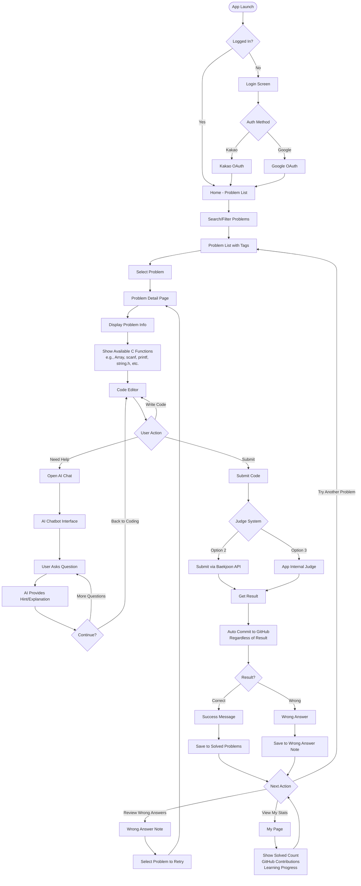
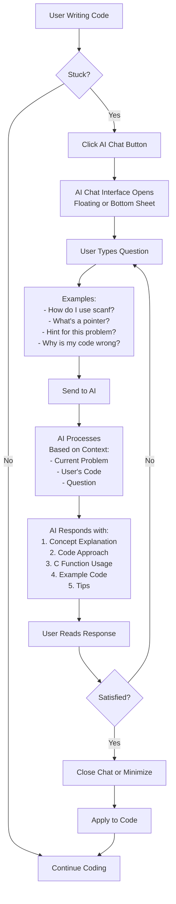
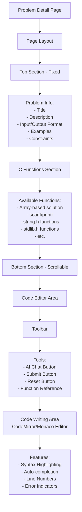
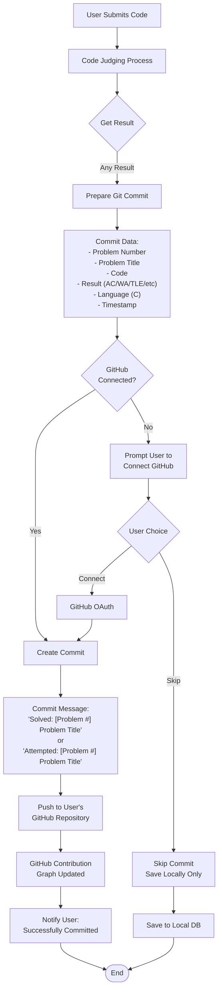
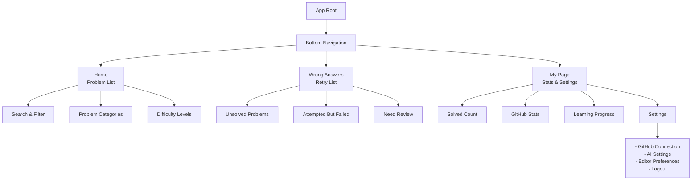
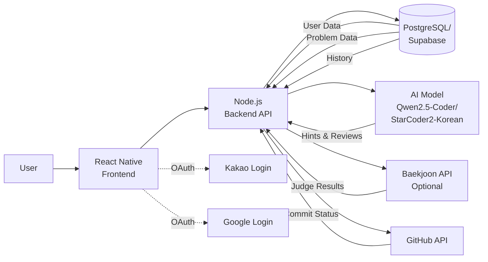

# App Flowchart

## Main User Flow

## AI Chat Interaction Detail

## Problem Solving Detail Flow

## GitHub Integration Flow

## Navigation Structure

## Data Flow

---

## Key User Journeys

### 1. First Time User
1. Download App → Login (Kakao/Google) → Tutorial → Browse Problems → Select First Problem → Read Problem & Functions → Start Coding → Ask AI for Help → Submit → GitHub Auto-commit → View Result

### 2. Regular User
1. Open App → Check Wrong Answer List → Select Problem to Retry → Review Previous Attempt → Code New Solution → Chat with AI → Submit → GitHub Commit → Success

### 3. Learning Journey
1. Browse Problems by Difficulty → Select Easy Problem → Read Function Suggestions → Try Array Approach → Get Stuck → Ask AI "How to use arrays?" → Implement → Submit → Success → Try Next Problem with Library Function → Compare Approaches

---

*This flowchart provides a comprehensive view of the app's user experience and technical architecture.*
