# Frontend Architecture & Flow Diagrams

## Overview

이 문서는 React Native 프론트엔드의 아키텍처, 데이터 플로우, 컴포넌트 계층 구조를 시각화합니다.

---

## 1. Frontend Architecture Overview

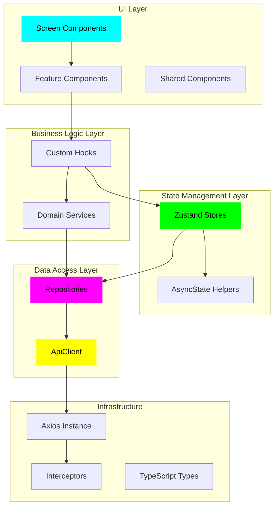

---

## 2. Data Flow Diagram

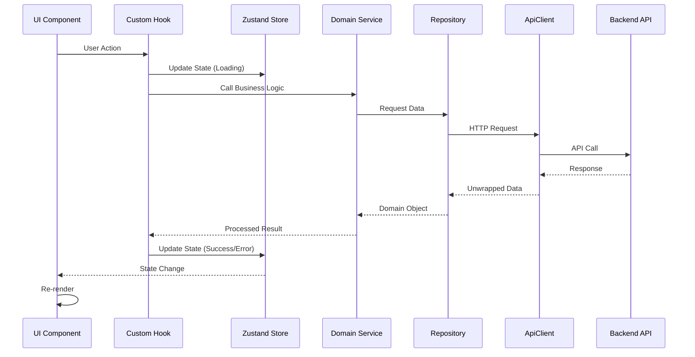

---

## 3. Component Hierarchy

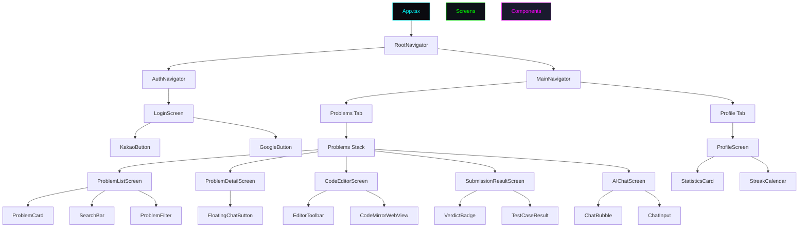

---

## 4. State Management Flow

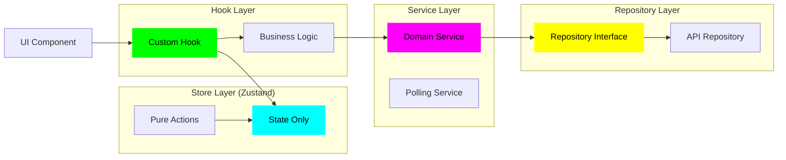

---

## 5. Feature Module Structure (Example: Problems)

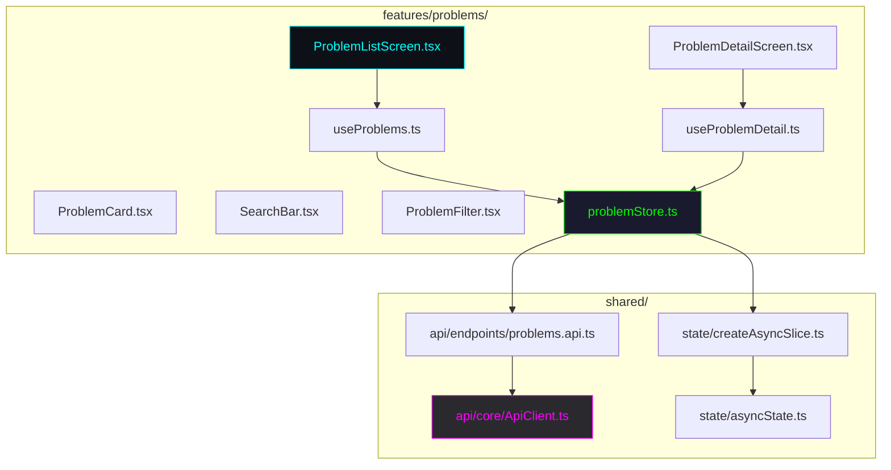

---

## 6. API Client Flow

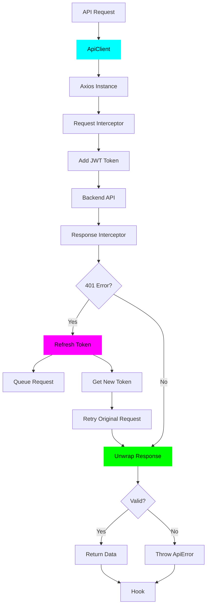

---

## 7. Authentication Flow

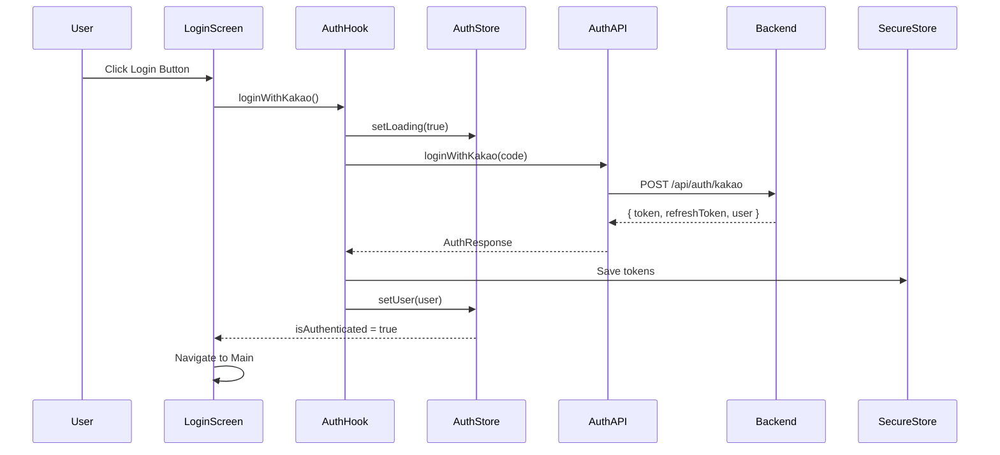

---

## 8. Code Submission Flow

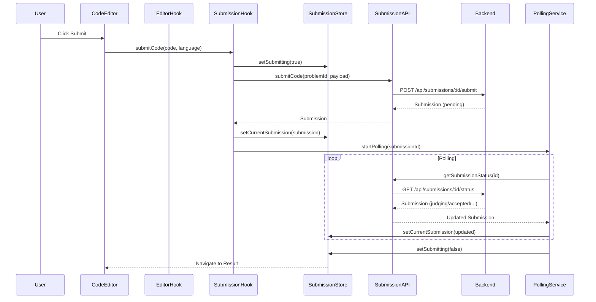

---

## 9. AI Chat Flow

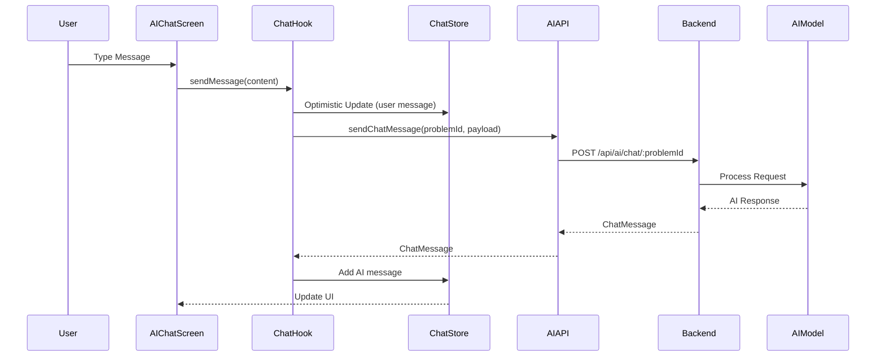

---

## 10. Navigation Structure

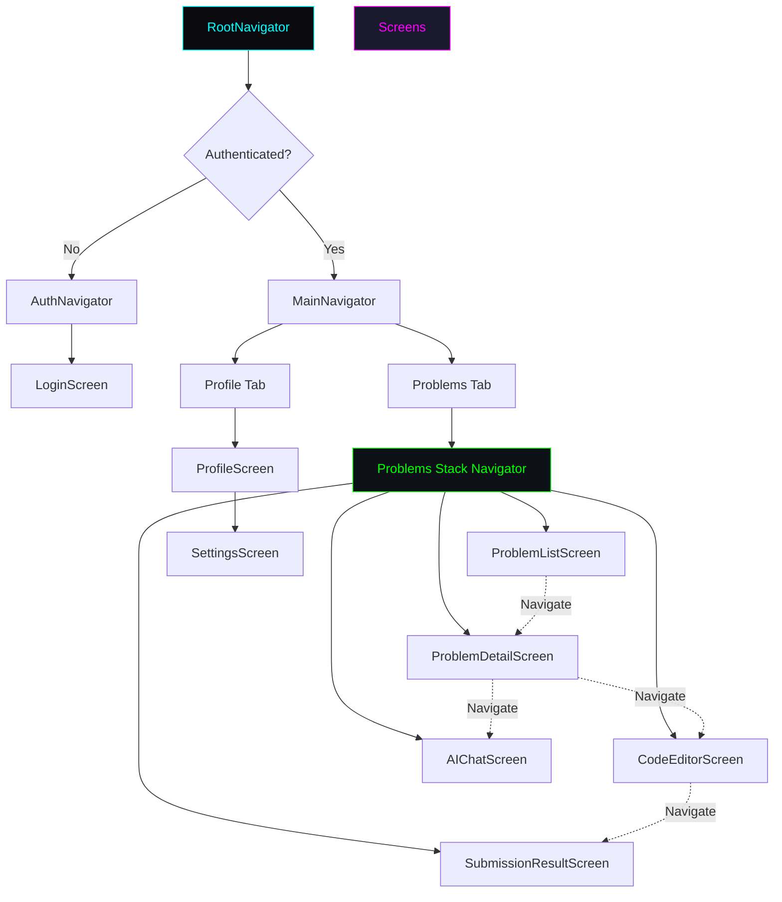

---

## 11. Store State Structure

```mermaid
graph TD
    subgraph "ProblemStore"
        ProblemState[State]
        ProblemList[problems: Problem[]]
        ProblemPagination[pagination: PaginationMeta]
        ProblemFilters[filters: GetProblemsParams]
        ProblemLoading[isLoading: boolean]
        ProblemError[error: string | null]
    end

    subgraph "SubmissionStore"
        SubmissionState[State]
        CurrentSubmission[currentSubmission: Submission | null]
        SubmissionLoading[isSubmitting: boolean]
        SubmissionError[error: string | null]
        SubmissionHistory[history: Submission[]]
    end

    subgraph "AuthStore"
        AuthState[State]
        User[user: User | null]
        IsAuthenticated[isAuthenticated: boolean]
        AuthLoading[isLoading: boolean]
    end

    subgraph "ChatStore"
        ChatState[State]
        Messages[messages: ChatMessage[]]
        ChatLoading[isSending: boolean]
        ChatError[error: string | null]
    end

    ProblemState --> ProblemList
    ProblemState --> ProblemPagination
    ProblemState --> ProblemFilters
    ProblemState --> ProblemLoading
    ProblemState --> ProblemError

    SubmissionState --> CurrentSubmission
    SubmissionState --> SubmissionLoading
    SubmissionState --> SubmissionError
    SubmissionState --> SubmissionHistory

    AuthState --> User
    AuthState --> IsAuthenticated
    AuthState --> AuthLoading

    ChatState --> Messages
    ChatState --> ChatLoading
    ChatState --> ChatError

    style ProblemState fill:#00ffff,stroke:#00ffff,color:#000
    style SubmissionState fill:#00ff00,stroke:#00ff00,color:#000
    style AuthState fill:#ff00ff,stroke:#ff00ff,color:#000
    style ChatState fill:#ffff00,stroke:#ffff00,color:#000
```

---

## 12. Error Handling Flow

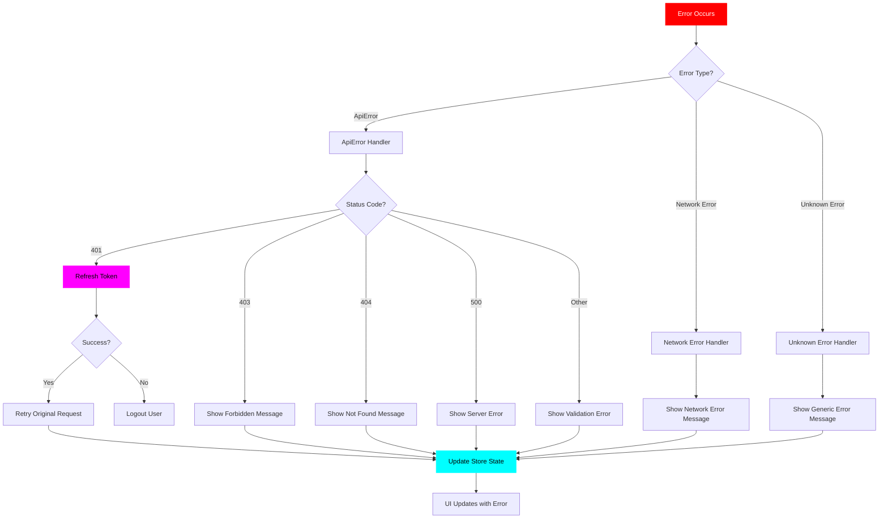

---

## 13. Theme & Styling Architecture

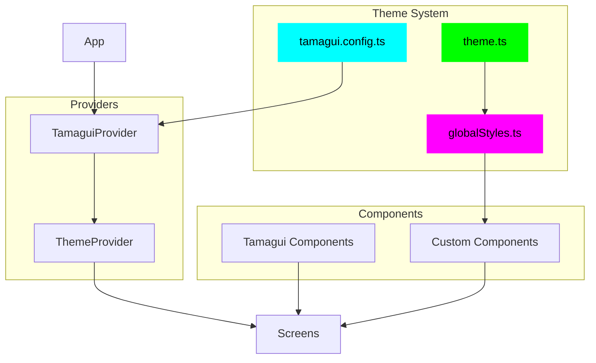

---

## 14. File Structure Overview

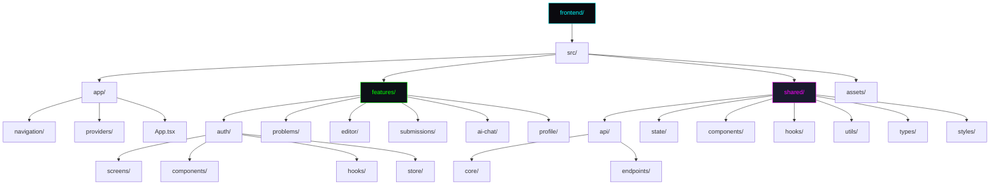

---

## 15. SOLID Principles Application

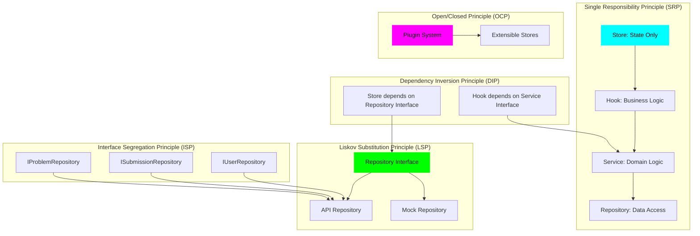

---

## Key Design Patterns Used

1. **Repository Pattern**: 데이터 접근 추상화
2. **Service Layer Pattern**: 비즈니스 로직 분리
3. **Custom Hooks Pattern**: 재사용 가능한 로직
4. **State Management Pattern**: Zustand를 통한 전역 상태
5. **Async State Pattern**: 일관된 비동기 상태 관리
6. **Error Boundary Pattern**: 에러 처리 및 복구

---

**Last Updated**: 2025-12-04
**Version**: 1.0.0

