# Sequence Diagram

## Overview
이 문서는 주요 사용자 시나리오에 대한 시퀀스 다이어그램을 제공합니다. 프론트엔드부터 백엔드까지의 전체 흐름을 시각화합니다.

---

## 1. Authentication Flow

### 1.1 Kakao Login

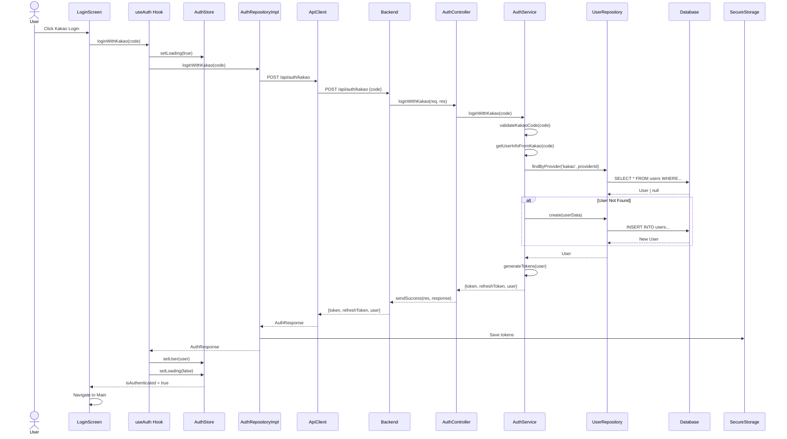

---

## 2. Problem Browsing Flow

### 2.1 Get Problem List with Filters

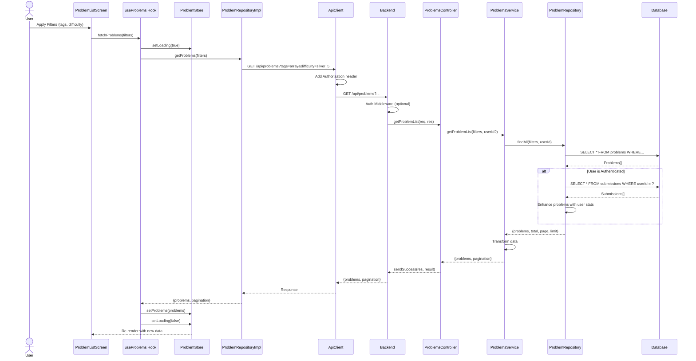

### 2.2 Get Problem Detail

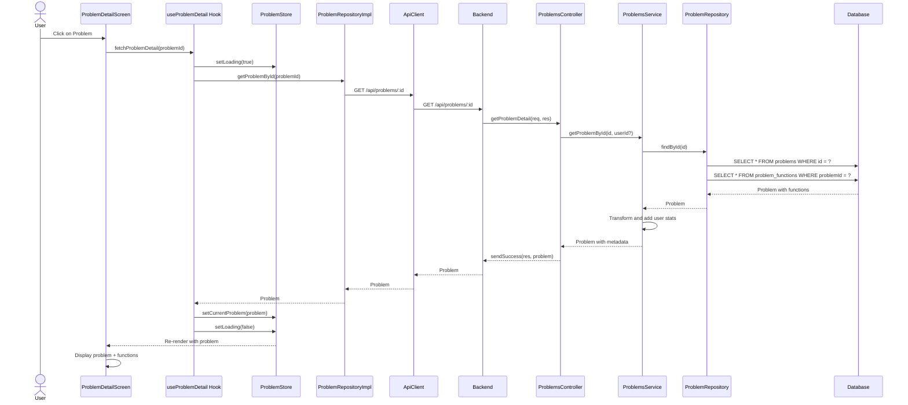

---

## 3. Code Submission Flow

### 3.1 Submit Code and Judge

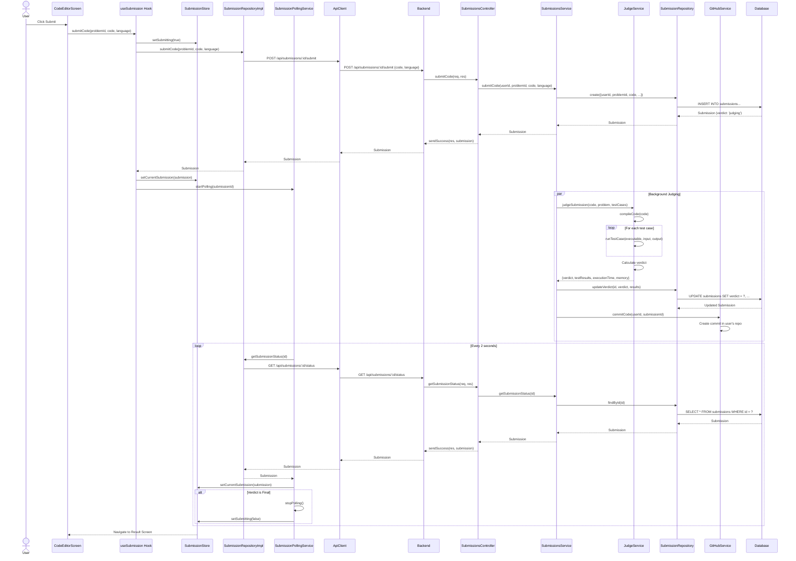

---

## 4. AI Chat Flow

### 4.1 Send Chat Message

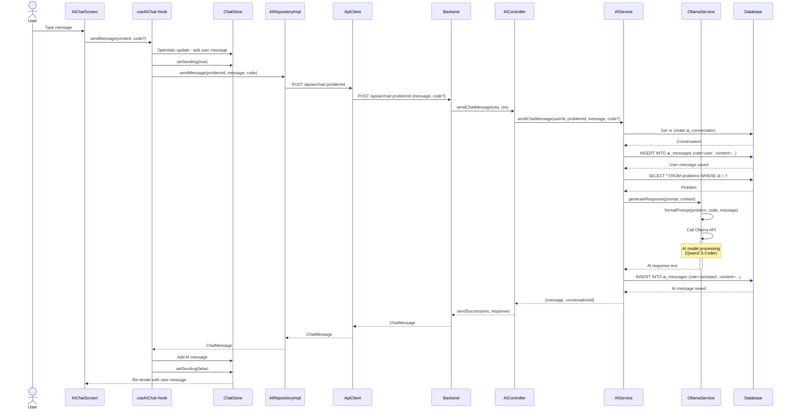

### 4.2 Request Code Review

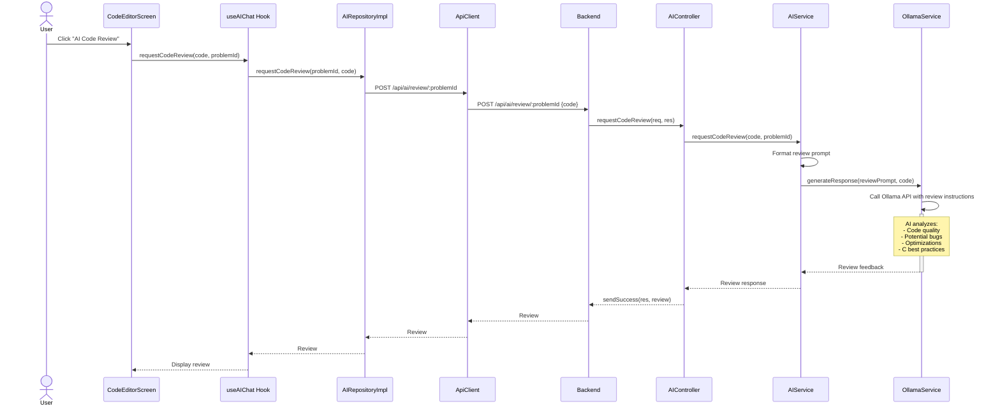

---

## 5. GitHub Integration Flow

### 5.1 Connect GitHub Account

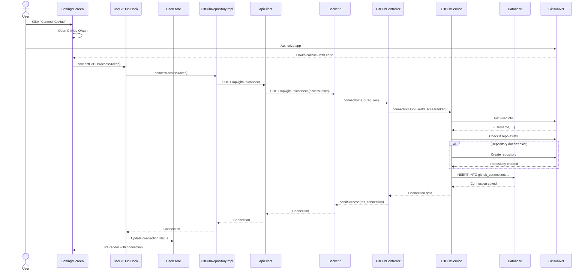

### 5.2 Auto-Commit Submission

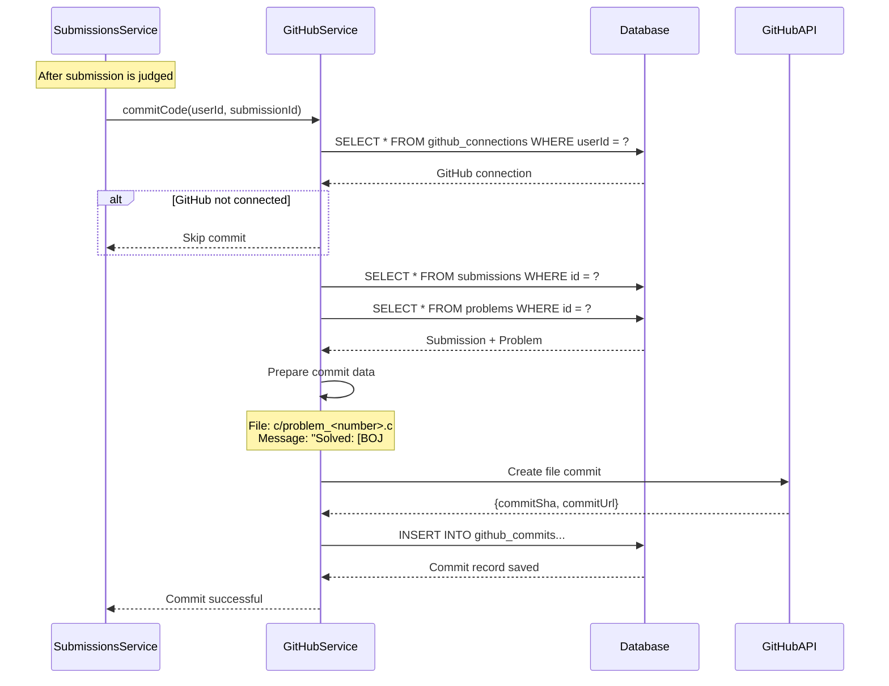

---

## 6. User Statistics Flow

### 6.1 Get User Statistics

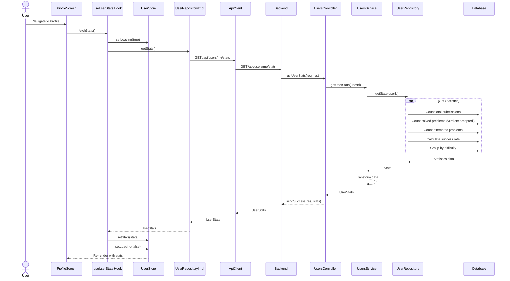

---

## 7. Error Handling Flow

### 7.1 API Error with Token Refresh

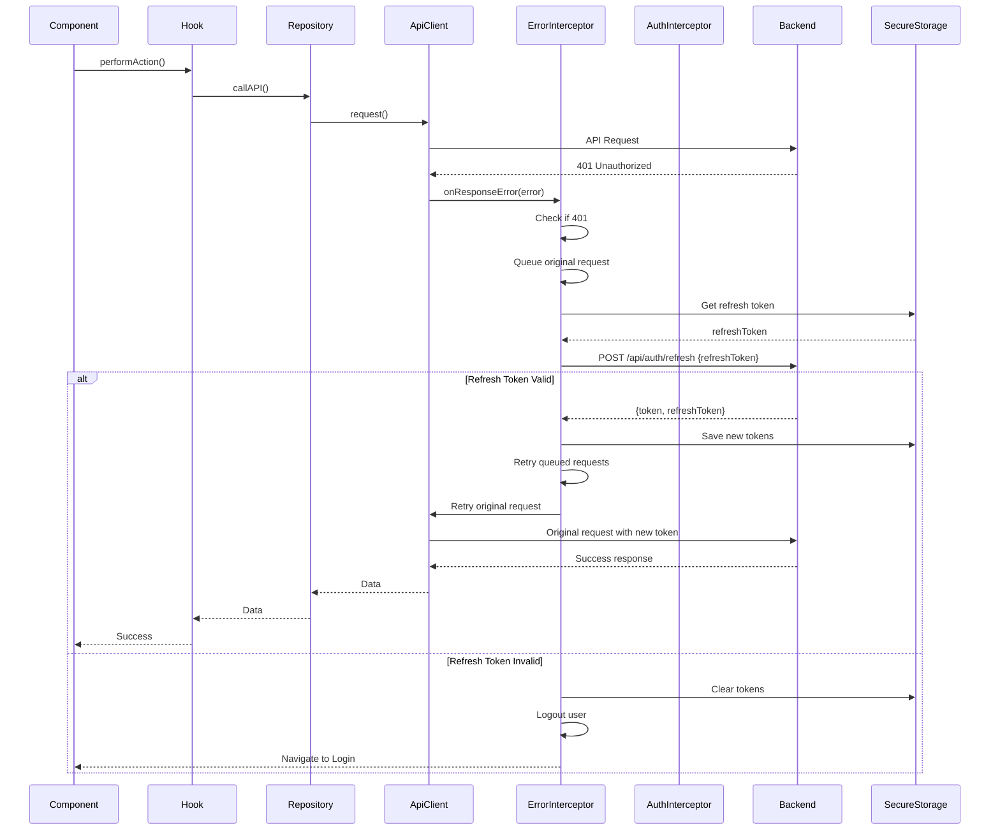

---

## 8. Real-time Polling Flow

### 8.1 Submission Status Polling

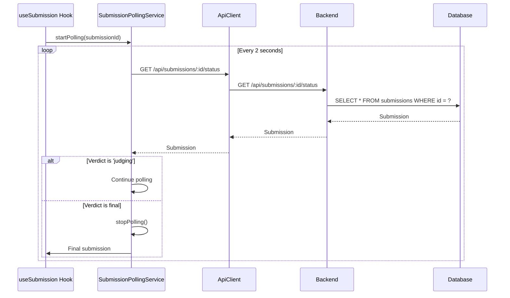

---

## 9. Data Caching and State Management

### 9.1 Store Update Flow

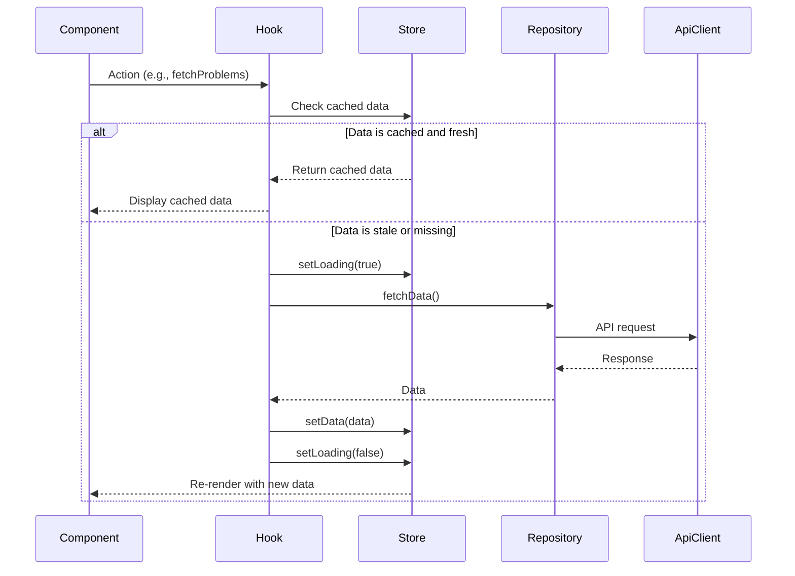

---

## 10. Code Auto-Save Flow

### 10.1 Draft Auto-Save

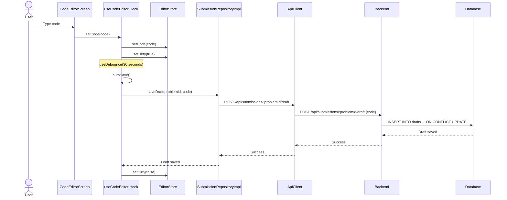

---

**Last Updated**: 2025-12-04
**Version**: 1.0.0
