# Use Cases Documentation

## Overview
This document defines all use cases for the C Language Learning App. Each use case will serve as the foundation for API endpoint design, function structure, and database schema.

---

## Use Case Categories

1. [Authentication & User Management](#1-authentication--user-management)
2. [Problem Browsing & Search](#2-problem-browsing--search)
3. [Problem Solving](#3-problem-solving)
4. [AI Assistance](#4-ai-assistance)
5. [Code Submission & Judging](#5-code-submission--judging)
6. [GitHub Integration](#6-github-integration)
7. [Wrong Answer Management](#7-wrong-answer-management)
8. [User Statistics & Profile](#8-user-statistics--profile)

---

## 1. Authentication & User Management

### UC-1.1: User Registration/Login
**Actor**: Guest User

**Preconditions**:
- User has installed the app
- User has Kakao or Google account

**Main Flow**:
1. User launches app
2. System displays login screen with Kakao/Google options
3. User selects login method
4. System redirects to OAuth provider
5. User authorizes the app
6. System receives OAuth token
7. System creates/updates user record in database
8. System generates JWT token
9. User is redirected to home screen

**Alternative Flows**:
- 3a. OAuth fails → Display error message
- 6a. User cancels → Return to login screen

**Postconditions**:
- User is authenticated
- JWT token is stored locally

**Related APIs**:
- `POST /api/auth/kakao`
- `POST /api/auth/google`
- `POST /api/auth/refresh`

---

### UC-1.2: Logout
**Actor**: Authenticated User

**Main Flow**:
1. User clicks logout in settings
2. System clears JWT token
3. System redirects to login screen

**Postconditions**:
- User session is terminated

**Related APIs**:
- `POST /api/auth/logout`

---

## 2. Problem Browsing & Search

### UC-2.1: View Problem List
**Actor**: Authenticated User

**Preconditions**:
- User is logged in

**Main Flow**:
1. User navigates to home screen
2. System fetches problem list from database
3. System displays problems with:
   - Problem number
   - Problem title
   - Difficulty level
   - Tags (Array, String, Math, etc.)
   - User's solve status (unsolved/attempted/solved)
4. User scrolls through list

**Postconditions**:
- Problem list is displayed

**Related APIs**:
- `GET /api/problems?page=1&limit=20`
- `GET /api/problems/stats` (user's solve statistics)

---

### UC-2.2: Search Problems
**Actor**: Authenticated User

**Main Flow**:
1. User enters search query (problem number, title, or keyword)
2. System searches database
3. System displays filtered results

**Alternative Flows**:
- 2a. No results found → Display "No problems found"

**Related APIs**:
- `GET /api/problems/search?q=1000`
- `GET /api/problems/search?q=Hello World`

---

### UC-2.3: Filter Problems by Tag/Difficulty
**Actor**: Authenticated User

**Main Flow**:
1. User selects filter options (tags: Array, String, etc. / difficulty: Baekjoon tier such as Bronze 5 ~ Ruby 1)
2. System filters problem list
3. System displays filtered results

**Related APIs**:
- `GET /api/problems?tags=array,string&difficulty=silver_5`

---

## 3. Problem Solving

### UC-3.1: View Problem Detail
**Actor**: Authenticated User

**Preconditions**:
- User has selected a problem

**Main Flow**:
1. User clicks on a problem
2. System fetches problem details
3. System displays:
   - Problem description
   - Input/Output format
   - Example test cases
   - Constraints
   - **Recommended C functions for this problem**
     - Example: "This problem can be solved using: Array, scanf/printf, string.h (strcpy, strlen), stdlib.h (atoi)"
4. System loads code editor below problem description
5. System pre-fills editor with C template code (includes, main function)

**Postconditions**:
- User can start coding

**Related APIs**:
- `GET /api/problems/:problemId`
- `GET /api/problems/:problemId/functions` (get recommended C functions)
- `GET /api/submissions/:problemId/my-last` (get user's last submission if exists)

---

### UC-3.2: Write Code
**Actor**: Authenticated User

**Main Flow**:
1. User types code in editor
2. System provides:
   - Syntax highlighting
   - Auto-completion
   - Line numbers
   - Real-time error detection (optional)
3. User saves code locally (auto-save every 30 seconds)

**Alternative Flows**:
- 3a. User clicks "Reset" → Code is cleared to template

**Related APIs**:
- `POST /api/submissions/:problemId/draft` (auto-save draft)
- `GET /api/submissions/:problemId/draft` (restore draft)

---

## 4. AI Assistance

### UC-4.1: Open AI Chat
**Actor**: Authenticated User

**Preconditions**:
- User is on problem detail page

**Main Flow**:
1. User clicks "AI Help" button
2. System opens chat interface (floating or bottom sheet)
3. System loads chat history for current problem (if exists)
4. User sees welcome message: "Hi! I'm your coding mentor. Ask me anything about this problem or C language!"

**Related APIs**:
- `GET /api/ai/chat/:problemId/history`

---

### UC-4.2: Ask AI Question
**Actor**: Authenticated User

**Main Flow**:
1. User types question in chat input
   - Examples:
     - "How do I use scanf?"
     - "What's a pointer?"
     - "Give me a hint for this problem"
     - "Why is my code giving wrong answer?"
     - "Explain string.h functions"
2. User sends message
3. System sends to AI model with context:
   - Current problem description
   - User's current code
   - Chat history
   - Question
4. AI processes request following rules:
   - Explain concept
   - Design approach
   - C code example
   - Test cases
   - Function/syntax explanation
5. System displays AI response in chat
6. User reads and can ask follow-up questions

**Alternative Flows**:
- 4a. AI response takes too long (>10s) → Show loading indicator
- 4b. AI fails → Display error message "AI is temporarily unavailable"

**Postconditions**:
- Chat history is saved
- User can continue conversation

**Related APIs**:
- `POST /api/ai/chat/:problemId`
  - Request body: `{ message: string, code?: string }`
  - Response: `{ response: string, conversationId: string }`

---

### UC-4.3: Request Code Review
**Actor**: Authenticated User

**Main Flow**:
1. User clicks "AI Code Review" button
2. System sends user's code to AI
3. AI analyzes code and provides:
   - Code quality feedback
   - Potential bugs
   - Optimization suggestions
   - C best practices
4. System displays review in chat

**Related APIs**:
- `POST /api/ai/review/:problemId`
  - Request body: `{ code: string }`

---

## 5. Code Submission & Judging

### UC-5.1: Submit Code
**Actor**: Authenticated User

**Preconditions**:
- User has written code

**Main Flow**:
1. User clicks "Submit" button
2. System validates code is not empty
3. System shows confirmation: "Submit your code?"
4. User confirms
5. System submits to judging system:
   - **Option A**: Send to Baekjoon API (if available)
   - **Option B**: Use app's internal judge with test cases
6. System shows "Judging..." indicator

**Alternative Flows**:
- 5a. Internal judge: System runs code against stored test cases
- 5b. Baekjoon API: System polls for result

**Related APIs**:
- `POST /api/submissions/:problemId/submit`
  - Request body: `{ code: string, language: 'c' }`
  - Response: `{ submissionId: string, status: 'judging' }`
- `GET /api/submissions/:submissionId/status`
  - Response: `{ status: 'judging' | 'accepted' | 'wrong' | 'tle' | 'error', ... }`

---

### UC-5.2: View Submission Result
**Actor**: Authenticated User

**Preconditions**:
- Code has been judged

**Main Flow**:
1. System receives judge result
2. System displays result:
   - **Accepted**: Green checkmark, "Correct! Well done!"
   - **Wrong Answer**: Red X, "Wrong answer. Check test cases."
   - **Time Limit Exceeded**: Clock icon, "Too slow. Optimize your algorithm."
   - **Runtime Error**: Error icon, "Your code crashed. Check for errors."
   - **Compile Error**: Warning icon, "Compilation failed: [error message]"
3. System shows:
   - Execution time
   - Memory usage
   - Test case results (passed/failed)
4. System triggers GitHub commit (regardless of result)

**Postconditions**:
- Submission is saved to database
- GitHub commit is created
- Problem status is updated

**Related APIs**:
- `GET /api/submissions/:submissionId`

---

## 6. GitHub Integration

### UC-6.1: Connect GitHub Account
**Actor**: Authenticated User

**Preconditions**:
- User is logged in
- User has GitHub account

**Main Flow**:
1. User goes to Settings
2. User clicks "Connect GitHub"
3. System redirects to GitHub OAuth
4. User authorizes app
5. System receives GitHub access token
6. System stores token in database
7. System creates/verifies target repository (e.g., "baekjoon-solutions")

**Alternative Flows**:
- 6a. Repository doesn't exist → System creates it
- 7a. User cancels → GitHub not connected

**Postconditions**:
- GitHub account is connected
- User can auto-commit solutions

**Related APIs**:
- `POST /api/github/connect`
- `GET /api/github/status`

---

### UC-6.2: Auto-Commit Solution
**Actor**: System (triggered by submission)

**Preconditions**:
- User has submitted code
- GitHub is connected

**Main Flow**:
1. System receives submission result
2. System prepares commit data:
   - File path: `c/problem_<number>.c`
   - File content: User's code
   - Commit message:
     - If accepted: `"Solved: [BOJ #<number>] <problem_title>"`
     - If wrong: `"Attempted: [BOJ #<number>] <problem_title>"`
3. System commits to GitHub via API
4. System pushes to repository
5. System updates user's GitHub contribution graph
6. System notifies user: "Committed to GitHub! ✓"

**Alternative Flows**:
- 2a. GitHub not connected → Skip commit, show "Connect GitHub to auto-commit"
- 3a. GitHub API fails → Retry once, then save to retry queue
- 3b. Network error → Save to local queue, retry later

**Postconditions**:
- Code is committed to GitHub
- User's contribution graph is updated

**Related APIs**:
- `POST /api/github/commit`
  - Request body: `{ submissionId: string }`
  - Response: `{ success: boolean, commitUrl?: string }`

---

## 7. Wrong Answer Management

### UC-7.1: View Wrong Answer List
**Actor**: Authenticated User

**Main Flow**:
1. User navigates to "Wrong Answers" tab
2. System fetches user's wrong submissions
3. System displays list with:
   - Problem number and title
   - Last attempted date
   - Number of attempts
   - Result (Wrong Answer / TLE / Runtime Error)
4. User can sort by: Date, Attempts, Difficulty

**Related APIs**:
- `GET /api/submissions/wrong`

---

### UC-7.2: Retry Problem from Wrong Answer List
**Actor**: Authenticated User

**Main Flow**:
1. User clicks on a problem in wrong answer list
2. System navigates to problem detail page
3. System shows user's previous attempt(s)
4. User can:
   - View previous code
   - Start fresh
   - Continue from last attempt
5. User writes new solution

**Related APIs**:
- `GET /api/submissions/:problemId/attempts` (all attempts for this problem)

---

## 8. User Statistics & Profile

### UC-8.1: View My Statistics
**Actor**: Authenticated User

**Main Flow**:
1. User navigates to "My Page" tab
2. System fetches and displays:
   - Total problems solved
   - Total attempts
   - Success rate (%)
   - Problems by difficulty (Bronze/Silver/Gold/Platinum, etc.)
   - Recent activity (last 7 days)
   - GitHub contribution graph
   - Streak (consecutive days)
3. User can view detailed history

**Related APIs**:
- `GET /api/users/me/stats`
- `GET /api/users/me/activity?days=7`

---

### UC-8.2: View Submission History
**Actor**: Authenticated User

**Main Flow**:
1. User clicks "History" in My Page
2. System displays chronological list of all submissions
3. Each entry shows:
   - Problem number and title
   - Date and time
   - Result
   - Code (expandable)
   - GitHub commit link (if available)

**Related APIs**:
- `GET /api/submissions/history?page=1&limit=20`

---

### UC-8.3: Update Settings
**Actor**: Authenticated User

**Main Flow**:
1. User clicks "Settings"
2. User can configure:
   - Editor preferences (font size, theme)
   - AI settings (hint level: beginner/intermediate/advanced)
   - GitHub auto-commit (on/off)
   - Notifications
3. System saves preferences

**Related APIs**:
- `GET /api/users/me/settings`
- `PUT /api/users/me/settings`

---

## Use Case Diagram

```mermaid
graph TD
    User([User]) --> UC1[Authentication]
    User --> UC2[Browse Problems]
    User --> UC3[Solve Problem]
    User --> UC4[AI Assistance]
    User --> UC5[Submit Code]
    User --> UC6[GitHub Integration]
    User --> UC7[Wrong Answers]
    User --> UC8[Statistics]

    UC1 --> UC1_1[Login with Kakao/Google]
    UC1 --> UC1_2[Logout]

    UC2 --> UC2_1[View Problem List]
    UC2 --> UC2_2[Search Problems]
    UC2 --> UC2_3[Filter by Tag/Difficulty]

    UC3 --> UC3_1[View Problem Detail]
    UC3 --> UC3_2[Write Code]

    UC4 --> UC4_1[Open AI Chat]
    UC4 --> UC4_2[Ask Question]
    UC4 --> UC4_3[Request Code Review]

    UC5 --> UC5_1[Submit Code]
    UC5 --> UC5_2[View Result]

    UC6 --> UC6_1[Connect GitHub]
    UC6 --> UC6_2[Auto-Commit]

    UC7 --> UC7_1[View Wrong List]
    UC7 --> UC7_2[Retry Problem]

    UC8 --> UC8_1[View Stats]
    UC8 --> UC8_2[View History]
    UC8 --> UC8_3[Update Settings]
```

---

## Next Steps

Based on these use cases, we will:
1. ✅ Define API endpoints for each use case
2. Design function structure and file organization
3. Choose architecture pattern (FSD, etc.)
4. Design database schema to support all use cases

---

*This document serves as the single source of truth for all app functionality.*
